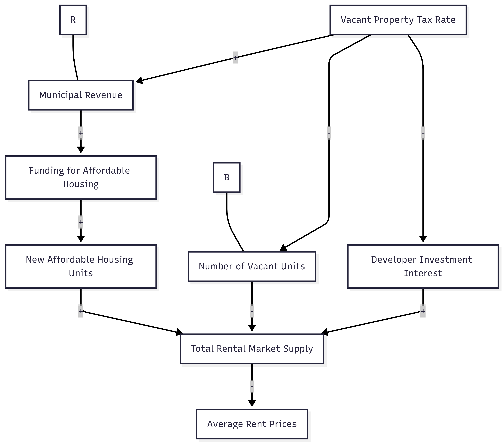

# Halifax Housing Policy Analysis: Vacant Tax or Direct Funding
## Should the Halifax Regional Council implement a Vacant Property Tax to discourage property owners from leaving units empty, or use municipal resources to directly fund new affordable housing construction projects?

The Halifax Regional Municipality (HRM) is currently grappling with a historic housing affordability crisis driven by rapid population growth and a critical shortage of supply. As of early 2024, Halifax’s apartment vacancy rate sits at a precarious 2.1%, well below the 3–4% required for a healthy market, while average rents have surged by over 6% in a single year. This environment has pushed many residents into "core housing need," where they spend more than 30% of their income on shelter, and has contributed to a sharp rise in visible homelessness across the municipality. For the Halifax Regional Council, the status quo is no longer sustainable, requiring a decisive choice between different policy levers to stabilize the market.

This decision matters because it represents a fundamental choice in municipal strategy: whether to use regulatory penalties to "unlock" existing inventory or to act as a direct investor in new supply. Implementing a Vacant Property Tax targets the demand side by penalizing owners who leave units empty, theoretically increasing rental supply immediately and generating revenue. Conversely, Directly Funding New Construction through grants to non-profits addresses the supply side by creating "deeply affordable" units that the private market often fails to provide. Each path carries significant trade-offs—one risks high administrative complexity and market friction, while the other faces the hurdles of high construction costs and slow delivery timelines.

 With Halifax holding one of the highest poverty rates among its peer cities, the Council's choice will determine if the municipality remains accessible to low-income workers and students who are the backbone of the local economy. This analysis aims to provide a data-driven framework to help the Housing Minister navigate these trade-offs and select the path that offers the greatest benefit to the community.

 

### This causal loop diagram shows how a vacant property tax influences housing supply through multiple feedback effects. One reinforcing loop occurs when higher tax rates increase municipal revenue, which allows the city to fund more affordable housing construction. Those new units increase the total rental housing supply, strengthening the long-term impact of the policy on expanding available housing. At the same time, there are balancing effects. Higher taxes reduce the number of vacant units by encouraging owners to rent them out, which increases supply and helps ease pressure on rents. However, the tax may also reduce developer investment interest, slowing private housing construction and limiting supply growth. The overall outcome depends on whether the public funding and vacancy reduction effects are stronger than the slowdown in private development.
